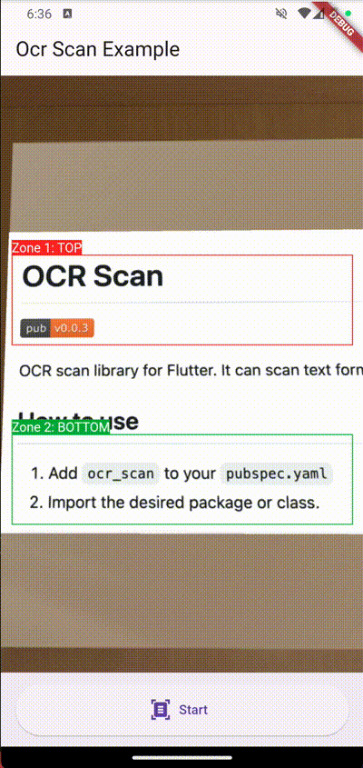

# OCR Scan

[](https://pub.dev/packages/ocr_scan)

OCR scan library for Flutter. It can scan text from zones in preview.



## Requirements

Since thus package uses [ML Kit](https://pub.dev/packages/google_mlkit_commons) check [requirements](https://github.com/bharat-biradar/Google-Ml-Kit-plugin#requirements) before running the package in project.


## How to use

1. Add `ocr_scan` to your `pubspec.yaml`
2. Import the desired package or class.

```dart
import 'package:ocr_scan/ocr_scan.dart';

Widget buildPreview(BuildContext context) {
  final ScaffoldMessengerState messenger = ScaffoldMessenger.of(context);

  return OcrScanPreview(
    ocrDuration: const Duration(milliseconds: 4000),
    ocrProcess: ocrProcess,
    ocrZonePainter: OcrScanZonePainter(
      elements: [
        const OcrScanZone(Rect.fromLTWH(0, 200, 1280, 100)), // Zone1 TOP
        const OcrScanZone(Rect.fromLTWH(0, 400, 1280, 100)), // Zone2 BOTTOM
      ],
      previewSize: const Size(1280, 720),
      strokeWidth: 2,
      color: Colors.red,
    ),
    onOcrTextLine: ((int, List<TextLine>) value) {
      messenger.showSnackBar(SnackBar(
        duration: const Duration(milliseconds: 2000),
        content: Text(
          value.$2.fold(
            'Rect ${value.$1 + 1} - Length ${value.$2.length}:',
            (String pre, TextLine e) => '$pre\n${e.text}',
          ),
        ),
      ));
    },
  );
}
```

## Contributing

Contributions are always welcome!

Please check out our [contribution guidelines](docs/CONTRIBUTING.md) for more details.

## License

ORC Scan is licensed under the [MIT License](https://github.com/development707/ocr_scan_flutter/blob/main/LICENSE).
