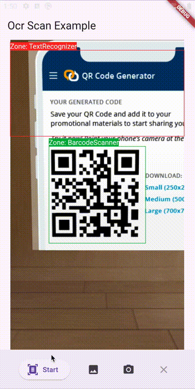

# OCR Scan

[](https://pub.dev/packages/ocr_scan)

OCR scan library for Flutter. It can scan text from zones in preview.

|       ScanPreview       |        ScanFile         |
| :---------------------: | :---------------------: |
|  |  |

## Requirements

Since thus package uses [ML Kit](https://pub.dev/packages/google_mlkit_commons) check [requirements](https://github.com/bharat-biradar/Google-Ml-Kit-plugin#requirements) before running the package in project.

## How to use

1. Add `ocr_scan` to your `pubspec.yaml`
2. Import the desired package or class.

```dart
import 'package:ocr_scan/ocr_scan.dart';

Widget buildPreview(BuildContext context) {
  final ScaffoldMessengerState messenger = ScaffoldMessenger.of(context);

  return ScanPreview(
    scanProcess: process,
    scanDuration: const Duration(milliseconds: 2000 * 3),
    textRecognizerConfig: TextRecognizerConfig(
      zonePainter: ZonePainter(
        elements: [
          const Zone(
            Rect.fromLTWH(40, 100, 1200, 100),
            text: TextSpan(
              text: 'Zone: TextRecognizer',
              style: TextStyle(backgroundColor: Colors.red),
            ),
            paintingColor: Colors.red,
          ),
        ],
      ),
      onTextLine: ((int, List<TextLine>) value) {
        messenger.showSnackBar(SnackBar(
          duration: const Duration(milliseconds: 2000),
          content: Text(
            value.$2.fold(
              'TextRecognizer - Length ${value.$2.length}:',
              (String pre, TextLine e) => '$pre\n${e.text}',
            ),
          ),
        ));
      },
    ),
    barcodeScannerConfig: BarcodeScannerConfig(
      zonePainter: ZonePainter(
        rotation: InputImageRotation.rotation90deg,
        elements: [
          Zone(
            Rect.fromCenter(
              center: const Size(720, 1280).center(Offset.zero),
              width: 400,
              height: 400,
            ),
            text: const TextSpan(
              text: 'Zone: BarcodeScanner',
              style: TextStyle(backgroundColor: Colors.green),
            ),
            paintingColor: Colors.green,
          ),
        ],
      ),
      onBarcode: ((int, List<Barcode>) value) {
        messenger.showSnackBar(SnackBar(
          duration: const Duration(milliseconds: 2000),
          content: Text(
            value.$2.fold(
              'BarcodeScanner - Length ${value.$2.length}:',
              (String pre, Barcode e) => '$pre\n${e.displayValue}',
            ),
          ),
        ));
      },
    ),
  );
}
```

## Contributing

Contributions are always welcome!

Please check out our [contribution guidelines](https://github.com/development707/ocr_scan_flutter/blob/main/doc/CONTRIBUTING.md) for more details.

## License

ORC Scan is licensed under the [MIT License](https://github.com/development707/ocr_scan_flutter/blob/main/LICENSE).
